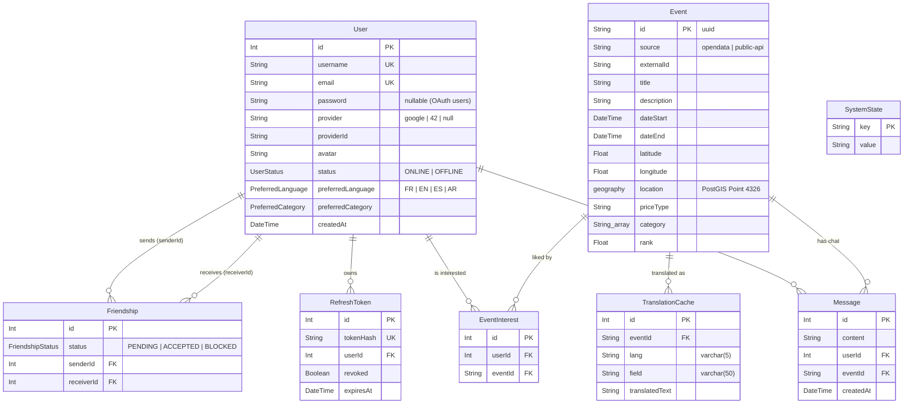

*This project has been created as part of the 42 curriculum by flebrun, maalwis, sleroy, helsnous, npagnon.*

# ft_transcendence — Paris Events Map

## Table of Contents

1. [Description](#description)
2. [Instructions](#instructions)
3. [Team Information](#team-information)
4. [Project Management](#project-management)
5. [Technical Stack](#technical-stack)
6. [Database Schema](#database-schema)
7. [Features List](#features-list)
8. [Modules](#modules)
9. [Individual Contributions](#individual-contributions)
10. [Resources](#resources)
11. [Known Limitations](#known-limitations)

---

## Description

**ft_transcendence — Paris Events Map** is a full-stack web application for finding events in Paris on an interactive map.

### Goal

We wanted to put all the cultural events in Paris (concerts, exhibitions, workshops, leisure…) on one map, and add a social layer on top. Users can see what is happening near them, say which events they are interested in, talk with other attendees in real time and see what their friends like.

### Overview

- Events come from the **Paris Open Data** "Que faire à Paris ?" dataset. They are imported when the app starts and again every day at midnight, then stored in **PostgreSQL + PostGIS**.
- External clients can also create, update and delete events through a **public REST API** protected by an API key.
- The **React** frontend shows the events on a **Leaflet** map with marker clustering, a search sidebar, filters, event details, a live chat for each event, friends and profile management.
- The **NestJS** backend provides a REST API and a **Socket.IO** gateway, both behind an **Nginx** HTTPS reverse proxy. Everything runs in **Podman** containers.

### Key Features

- Interactive Leaflet map of Paris with marker clustering, and map tiles proxied through the backend
- Paris Open Data ingestion (at startup, then a daily cron job)
- Advanced search: text search, category, price and date filters, sorting (date, title, popularity) and server-side pagination
- Geospatial "nearby events" search (PostGIS `ST_DWithin`)
- Registration and login with JWT access/refresh tokens, and remote OAuth 2.0 login (Google and 42)
- User profiles: avatar upload, preferred language and preferred category
- Friends: search, requests, accept/refuse, online status
- A real-time chat for each event and live updates over WebSockets
- Event interests ("likes"), with the friends who are interested shown on each event
- 4 languages: French, English, Spanish and Arabic, with a full right-to-left (RTL) layout for Arabic
- On-demand translation of event content with LibreTranslate
- GDPR: personal-data export, and account deletion confirmed by email
- Public API with API key, rate limiting and Swagger/OpenAPI documentation
- Centralized logging with ELK (Elasticsearch, Logstash, Kibana), with retention and archiving policies
- HTTPS everywhere through Nginx, and a responsive interface for desktop and mobile

---

## Instructions

### Prerequisites

| Tool                        | Version / notes                                                                                     |
| --------------------------- | --------------------------------------------------------------------------------------------------- |
| Linux (tested on 42 school computers and Fedora) | `make` uses `hostname -I`                                                      |
| Git                         | any recent version                                                                                  |
| Podman                      | 4.x or later, rootless                                                                              |
| Podman Compose              | used through `podman compose`                                                                       |
| GNU Make                    | used to run every command                                                                           |
| OpenSSL                     | used to generate secrets for `.env`                                                                 |
| A modern web browser        | Firefox or Chromium                                                                                 |

You do **not** need Node.js on your machine: every service (frontend, backend) builds and runs in `node:20-alpine` containers.

We use Podman instead of Docker because Docker requires root access, which we don't have on the 42 school computers.

External accounts you need for some features:

- **Google OAuth** and **42 OAuth** apps (client ID and secret) for remote login
- A **Jawg Maps** token for the map tiles
- A **Gmail** account with an [App Password](https://support.google.com/accounts/answer/185833) for the GDPR confirmation emails

### 1. Clone the repository

```bash
git clone https://github.com/maxalwis/Ft_Transcendence
cd Ft_Transcendence
```

### 2. Configure the environment

```bash
cp .env.example .env
```

Replace every `change_me` / `your_*` value in `.env`. You can generate secrets with:

```bash
openssl rand -base64 48   # JWT_SECRET, JWT_REFRESH_SECRET, PUBLIC_API_KEY, admin/Elastic passwords
openssl rand -hex 24      # POSTGRES_PASSWORD (it goes into DATABASE_URL, so avoid URL special characters)
```

| Group          | Variables                                                                                   |
| -------------- | ------------------------------------------------------------------------------------------- |
| Ports / URLs   | `HTTPS_PORT` (default `8443`), `FRONTEND_URL`, `APP_URL`, `POSTGRES_PORT`, `BACKEND_PORT`, `STUDIO_PORT` |
| Database       | `POSTGRES_USER`, `POSTGRES_PASSWORD`, `POSTGRES_DB`, `DATABASE_URL`                         |
| Authentication | `JWT_SECRET`, `JWT_REFRESH_SECRET`                                                          |
| OAuth          | `GOOGLE_CLIENT_ID/SECRET/CALLBACK_URL`, `FORTYTWO_CLIENT_ID/SECRET/CALLBACK_URL`            |
| Public API     | `PUBLIC_API_KEY`                                                                            |
| Translation    | `LIBRETRANSLATE_URL`                                                                        |
| Mail           | `MAIL_HOST`, `MAIL_PORT`, `MAIL_USER`, `MAIL_PASS`, `MAIL_FROM`                             |
| Map            | `JAWG_TOKEN`                                                                                |
| Admin tools    | `ADMIN_AUTH_USER`, `ADMIN_AUTH_PASSWORD`                                                    |
| ELK            | `ELASTIC_PASSWORD`, `KIBANA_SYSTEM_PASSWORD`, `LOGSTASH_INTERNAL_PASSWORD`                  |

> `.env` is ignored by git. Never commit real credentials, API keys or OAuth secrets.

### 3. Build and start the application

```bash
make          # same as `make up`: starts every container and follows the logs
```

On first launch, the backend applies the Prisma migrations, generates the Prisma client and imports the Paris Open Data events. LibreTranslate also downloads its language models on first launch, so the first startup can take a few minutes.

### 4. Open the application

```text
https://localhost:8443
```

The HTTPS certificate is self-signed and generated locally, so your browser will show a security warning the first time. This is expected in local development.

| URL                                  | What it is                            |
| ------------------------------------ | ------------------------------------- |
| `https://localhost:8443`             | Web application                       |
| `https://localhost:8443/api/docs`    | Swagger / OpenAPI documentation       |
| `https://localhost:8443/api/v1/events` | Public API (header `x-api-key` required) |

### 5. Useful Make targets

| Command              | Description                                                               |
| -------------------- | ------------------------------------------------------------------------- |
| `make` / `make up`   | Start the application and follow the logs                                 |
| `make build`         | Build the images                                                          |
| `make down`          | Stop the containers                                                       |
| `make restart`       | `down` + `up`                                                             |
| `make logs`          | Follow the logs                                                           |
| `make seed`          | Fill the database with demo data                                          |
| `make test`          | Run the unit tests, the health check and the end-to-end tests             |
| `make elk`           | Start the application together with the ELK stack                        |
| `make prisma-studio` | Start the application together with Prisma Studio                        |
| `make clean`         | Stop the containers and remove the volumes                                |
| `make fclean`        | Remove all containers, images and volumes, and prune Podman               |
| `make re`            | `fclean` + `all`                                                          |

### 6. Run the tests

```bash
make test
```

- `test-unit`: Jest unit tests of the backend services, controllers and gateway, run in a container
- `test-health`: `GET /health` on the running backend (checks Postgres)
- `test-e2e`: end-to-end tests for users, friends, messages, realtime, event search, event interests and GDPR

### 7. Monitoring with ELK (optional)

```bash
make elk
```

This starts Elasticsearch, Logstash and Kibana with the `elk` Compose profile. Before Kibana and Logstash start, a one-shot `elasticsearch-setup` container ([elasticsearch/scripts/setup.sh](elasticsearch/scripts/setup.sh)) configures the cluster:

- **Security**: `xpack.security` is enabled, so every request to Elasticsearch needs authentication. Kibana logs in with the built-in `kibana_system` user. Logstash logs in with a `logstash_internal` user that can only write to `nestjs-logs-*`.
- **Retention**: the ILM policy `nestjs-logs-policy` keeps each daily index "hot" for 7 days. After that, it force-merges the index and makes it read-only ("warm"). The index is deleted after 30 days.
- **Archiving**: every night, the SLM policy `daily-logs-archive` takes a snapshot of every log index into the `logs-archive` repository (`elasticsearch_snapshots` volume). Snapshots are kept for 1 year.

Access (HTTPS through Nginx, behind basic auth with `ADMIN_AUTH_USER` / `ADMIN_AUTH_PASSWORD`):

- Kibana: `https://localhost:8445`, then log in on the Kibana page with `elastic` / `ELASTIC_PASSWORD`
- Elasticsearch: `https://localhost:8447`, with `elastic` / `ELASTIC_PASSWORD`

---

## Team Information

We are a team of five. Each member owned one main area, but the work stayed collaborative: members often fixed, tested and integrated code in areas they did not own.

| Login        | Role(s)                                      | Responsibilities |
| ------------ | -------------------------------------------- | ---------------- |
| **flebrun**  | Tech Lead · DevOps · Frontend developer      | Overall architecture and integration of all the parts; Podman/Compose setup; ELK; interactive map and clustering; custom design system; Arabic RTL; unblocking cross-module issues. |
| **sleroy**   | Product Owner · Backend developer            | Product vision and feature priorities; initial NestJS/Prisma/PostGIS backend; events API and geospatial queries; JWT and OAuth authentication; WebSocket gateway; event interests; translations; security hardening of the whole API. |
| **maalwis**  | Product Manager · Frontend developer         | Planning and task follow-up; React pages and layouts: login/register, event details, profile, friends, chat; responsive design; frontend translations. |
| **helsnous** | Backend developer · Full-stack (search)      | Users module and CRUD; friend requests; Open Data sync and health checks; advanced event filters on both backend and frontend; legal pages and their translations. |
| **npagnon**  | Backend developer · Infrastructure           | First Nginx reverse proxy and HTTPS setup; public API (API key, rate limiting, OpenAPI); GDPR data export and account deletion with confirmation emails. |

---

## Project Management

### Work organization

- **Split by domain**: we divided the work by area (infrastructure, backend core, frontend, search, public API/GDPR), and each member was responsible for their area from start to finish.
- **In-person meetings** at school: short regular syncs to share progress, make technical decisions together, and split up the next tasks.
- **Feature branches and pull requests**: each feature was built on its own branch, then merged into `dev` through a pull request. Pull requests were also where we reviewed code and resolved merge conflicts.

### Git workflow

- Branch naming: `<login>/<feature>`, for example `flebrun/elk-stack-implementing`, `sleroy/events-schema-api`, `maalwis/front-profile`, `npagnon/public-api`, `helasnoussi/backend-categories`.
- Integration branch: `dev`.
- Commit prefixes showing the area touched: `[FE]`, `[BE]`, `[NGX]`, `[DO]`, `[Pods]`, or Conventional Commits (`feat(auth): …`, `fix(gdpr): …`).
- Formatting (Prettier) and linting (ESLint) are shared and run before merging.

### Tools

| Tool                    | Usage                                        |
| ----------------------- | -------------------------------------------- |
| GitHub (branches, PRs)  | Version control, code review, integration    |
| Notion                  | Tickets and task tracking                    |
| Google Sheets           | Who is responsible for each module, and point tracking |

### Communication channels

- **Discord**: daily communication and technical discussions
- **In person** at 42 Paris: meetings, pair debugging, decisions

---

## Technical Stack

### Frontend

| Technology                      | Purpose                              |
| ------------------------------- | ------------------------------------ |
| React 19 + TypeScript           | Component-based UI with types        |
| Vite                            | Dev server and production build      |
| Tailwind CSS 4 + CSS modules    | Styling, used by the design system   |
| React Router                    | Client-side routing                  |
| Leaflet, React Leaflet, react-leaflet-cluster | Interactive map and marker clustering |
| Socket.IO client                | Real-time communication              |
| i18next / react-i18next         | Internationalization (FR/EN/ES/AR)   |

### Backend

| Technology                        | Purpose                                            |
| --------------------------------- | -------------------------------------------------- |
| NestJS 11 + TypeScript on Node 20 | Modular backend framework                          |
| Prisma 7                          | ORM, migrations, type-safe queries                 |
| Passport (local, JWT, Google, OAuth2 for 42) | Authentication strategies               |
| `@nestjs/jwt`, bcrypt             | Access/refresh tokens, password hashing            |
| `@nestjs/websockets` + Socket.IO  | Real-time gateway                                  |
| `@nestjs/throttler`               | Rate limiting (global, auth, chat, public API)     |
| `@nestjs/schedule`                | Daily Open Data ingestion cron job                 |
| `@nestjs/swagger`                 | OpenAPI documentation                              |
| `@nestjs/terminus`                | Health checks (Postgres)                           |
| Nodemailer                        | GDPR confirmation emails (authenticated SMTP)      |
| Jest + Supertest                  | Unit and end-to-end tests                          |

### Database

| Technology              | Purpose                               |
| ----------------------- | ------------------------------------- |
| PostgreSQL 16           | Main relational database              |
| PostGIS 3.4             | `geography(Point, 4326)` column and radius queries |

**Why PostgreSQL + PostGIS?** Our data is relational: users, friendships, messages, interests and events all reference each other, and we rely on foreign keys, unique constraints and cascading deletes (which also makes GDPR deletion simple). PostGIS gives us real geospatial types and indexes, so "events within X metres" is a single `ST_DWithin` query instead of distance calculations in JavaScript. PostgreSQL also works very well with Prisma.

### Infrastructure & other services

| Technology                     | Purpose                                              |
| ------------------------------ | ---------------------------------------------------- |
| Podman + Podman Compose        | Rootless containers and orchestration                |
| Nginx                          | TLS termination, reverse proxy, WebSocket upgrade, basic auth for admin tools |
| Elasticsearch, Logstash, Kibana 8.11 | Centralized logs, dashboards, retention, archiving |
| LibreTranslate                 | Self-hosted translation of event content             |
| Jawg Maps                      | Map tiles (the token stays on the backend, which proxies the tiles) |

### Justification of the major technical choices

- **React + Vite**: most of the team already knew React, it has a large ecosystem (React Leaflet, i18next), and Vite gives very fast hot reloading.
- **NestJS**: its module/controller/service structure matched the way we split the work (one Nest module per domain: `auth`, `events`, `friends`, `gdpr`, `public-api`…), so we could work in parallel with few conflicts. It also includes guards, DTO validation, WebSockets and Swagger.
- **TypeScript on both sides**: one language for the whole team, and types shared between the API and the UI.
- **Prisma**: declarative schema, versioned migrations and a typed client. For PostGIS columns, which Prisma does not support natively, we use `Prisma.sql` raw queries with parameters.
- **Socket.IO**: automatic reconnection, and rooms (`event:<id>`, `user:<id>`) that match our needs directly: a chat room per event and notifications per user.
- **Podman**: runs without root on the school computers.
- **Leaflet**: open source and lightweight, with good clustering plugins, and no vendor lock-in.

---

## Database Schema



| Table              | Role                                                                    | Key constraints |
| ------------------ | ----------------------------------------------------------------------- | --------------- |
| `User`             | Accounts (local or OAuth), profile and preferences                      | `username`, `email` and `(provider, providerId)` are unique |
| `Event`            | Events from Open Data or from the public API; `location` is a PostGIS geography point | `(source, externalId)` is unique, so re-importing updates existing events instead of duplicating them |
| `Message`          | Chat messages, one chat per event                                       | Deleted automatically with their user or event |
| `Friendship`       | A directed friend request between two users                             | `(senderId, receiverId)` is unique |
| `EventInterest`    | A user "likes" an event                                                 | `(userId, eventId)` is unique; indexed on both columns |
| `RefreshToken`     | Hashed refresh tokens, which can be revoked (logout, password change)   | `tokenHash` is unique |
| `TranslationCache` | LibreTranslate results, cached per event, language and field            | `(eventId, lang, field)` is unique |
| `SystemState`      | Key/value store for internal state (for example the last ingestion date) | — |

Every relation to `User` uses `onDelete: Cascade`, so deleting an account (GDPR) removes all of that user's personal data in one operation.

The source of truth is [backend/prisma/schema.prisma](backend/prisma/schema.prisma), and the migrations are in [backend/prisma/migrations/](backend/prisma/migrations/).

---

## Features List

| Feature                  | Description                                                                                   | Team member(s)                     |
| ------------------------ | --------------------------------------------------------------------------------------------- | ---------------------------------- |
| Open Data ingestion      | Imports events from Paris Open Data at startup and every day at midnight, upserts them into PostGIS and removes HTML from price details | sleroy, helsnous, flebrun |
| Interactive map          | Leaflet map of Paris; the events loaded depend on the visible area, the zoom level is limited, and tiles are proxied through the backend | flebrun, sleroy, maalwis |
| Marker clustering        | Groups nearby markers; clusters split correctly when zooming in                               | flebrun                            |
| Event details            | Event preview and detail view: cover image, dates, address, price, categories and access link | maalwis, flebrun                   |
| Advanced search          | Text search (title, description, venue), category, price and date filters, sorting and pagination | helsnous, sleroy, flebrun      |
| Nearby events            | Geospatial radius search around a point                                                      | sleroy                             |
| Registration / login     | Local accounts with bcrypt; JWT access and refresh tokens; rate-limited auth routes           | sleroy, maalwis                    |
| OAuth 2.0                | Login with Google or 42, protected against account takeover through email linking             | sleroy, maalwis                    |
| Profile                  | Avatar upload, username, password change (revokes all sessions), preferred language and category | maalwis, sleroy, helsnous       |
| Friends                  | User search, send/accept/refuse requests, friends list with online status                     | maalwis, helsnous, sleroy, flebrun |
| Real-time chat           | A chat room per event over Socket.IO, with saved history and message limits                   | sleroy, maalwis, flebrun           |
| Live updates             | Live interest counts, friend and session events pushed over WebSockets                        | sleroy, flebrun                    |
| Event interests          | Like/unlike events; see which friends are interested                                          | sleroy, maalwis                    |
| Internationalization     | FR, EN, ES and AR interface; i18n lint checker for missing or unused keys                     | sleroy, helsnous, maalwis, flebrun |
| RTL support              | Full right-to-left layout for Arabic                                                          | flebrun, maalwis                   |
| Content translation      | On-demand translation of event content with LibreTranslate, cached in the database            | sleroy                             |
| Public API               | CRUD on events with an API key, rate limiting and pagination                                  | npagnon, sleroy                    |
| API documentation        | Swagger UI at `/api/docs`                                                                     | npagnon, sleroy                    |
| GDPR                     | JSON export of personal data (including liked events), account deletion confirmed by email, other tabs logged out after deletion | npagnon, sleroy, flebrun |
| Legal pages              | Terms of service and privacy policy, in every language                                        | helsnous, maalwis, sleroy          |
| Design system            | Reusable UI components (Button, Card, Chip, Badge, Avatar, TextField, Select, Pagination, Spinner, Toast, EmptyState, ModalLayout) | flebrun, maalwis |
| Responsive UI            | Mobile menu, collapsible sidebar, responsive layouts                                          | maalwis, flebrun                   |
| Centralized logging      | Backend HTTP logs → Logstash → Elasticsearch → Kibana dashboards; secrets redacted            | flebrun, sleroy                    |
| HTTPS / reverse proxy    | A single HTTPS entry point, WebSocket proxying, basic auth for admin tools                    | npagnon, flebrun, sleroy           |
| Health checks and tests  | `/health` endpoint (Postgres); unit and e2e tests run in containers                 | sleroy, helsnous, flebrun          |

---

## Modules

### Summary

| #  | Category         | Module                                             | Type  | Points |
| -- | ---------------- | -------------------------------------------------- | ----- | -----: |
| 1  | Web              | Use a framework for both frontend and backend      | Major | 2 |
| 2  | Web              | User interaction (chat, profile, friends)          | Major | 2 |
| 3  | Web              | Public API                                         | Major | 2 |
| 4  | Web              | Real-time features using WebSockets                | Major | 2 |
| 5  | Web              | Use an ORM                                         | Minor | 1 |
| 6  | Web              | Custom design system                               | Minor | 1 |
| 7  | Web              | Advanced search                                    | Minor | 1 |
| 8  | Accessibility    | Support for multiple languages                     | Minor | 1 |
| 9  | Accessibility    | Right-to-left (RTL) language support               | Minor | 1 |
| 10 | User management  | Standard user management and authentication        | Major | 2 |
| 11 | User management  | Remote authentication with OAuth 2.0               | Minor | 1 |
| 12 | DevOps           | Infrastructure for log management with ELK         | Major | 2 |
| 13 | Data & analytics | GDPR compliance features                           | Minor | 1 |

**Point calculation:** 6 Major × 2 pts + 7 Minor × 1 pt = 12 + 7 = **19 points**.

This table lists the modules we implemented. The final validation of each module is decided during the 42 evaluation.

### Details

**1. Frameworks for frontend and backend (Major): maalwis, sleroy, flebrun**
- *Why:* both frameworks give structure to a 5-person codebase and let us work in parallel.
- *How:* React + Vite for the SPA ([front/](front/)); NestJS with one module per domain ([backend/src/](backend/src/)).

**2. User interaction (Major): maalwis, sleroy, helsnous, flebrun, npagnon**
- *Why:* the social layer (chatting and seeing what friends like) is the core of the project's idea.
- *How:* a chat for each event (`events/:eventId/messages` + Socket.IO room); profile pages; friend requests stored in `Friendship`; online status tracked by the realtime session tracker.

**3. Public API (Major): npagnon, sleroy**
- *Why:* lets external partners add events that are not in the Open Data dataset.
- *How:* `GET/POST/PUT/DELETE /api/v1/events`, protected by an `x-api-key` guard and a dedicated throttler, with DTOs validated, paginated results and documentation in Swagger ([backend/src/public-api/](backend/src/public-api/)).

**4. Real-time features with WebSockets (Major): sleroy, flebrun, npagnon**
- *Why:* chat and live updates need push communication, not polling.
- *How:* an authenticated Socket.IO gateway (JWT verified on connection, sockets closed when the token expires), `event:<id>` and `user:<id>` rooms, and a `RealtimeEmitterService` that other modules use to broadcast updates ([backend/src/realtime/](backend/src/realtime/)).

**5. ORM (Minor): sleroy, helsnous**
- *Why:* typed queries and versioned migrations for a schema that five people edit.
- *How:* Prisma 7 with the `postgresqlExtensions` preview feature enabled for PostGIS; raw parameterized SQL (`Prisma.sql`) for geospatial queries.

**6. Custom design system (Minor): flebrun, maalwis**
- *Why:* a consistent look and less duplicated CSS across all the modals and sidebars.
- *How:* 12 reusable components in [front/src/components/ui/](front/src/components/ui/) (Button, Card, Chip, Badge, Avatar, TextField, Select, Pagination, Spinner, Toast, EmptyState, ModalLayout), with shared colors, typography and icons.

**7. Advanced search (Minor): helsnous, sleroy, flebrun**
- *Why:* Paris has thousands of events, so users need to narrow them down.
- *How:* `GET /api/events/search` with a text query, categories, price type, date range, sorting (date/title/popularity) and server-side pagination; the frontend shows a filters modal and paginated results in the sidebar.

**8. Multiple languages (Minor): sleroy, helsnous, maalwis, flebrun**
- *Why:* Paris attracts an international audience.
- *How:* i18next with `fr`, `en`, `es` and `ar` locale files ([front/src/locales/](front/src/locales/)), a language selector, the user's preferred language applied at login, and an i18n checker script for missing or unused keys.

**9. RTL language support (Minor): flebrun, maalwis**
- *Why:* Arabic is widely spoken in Paris and needs a mirrored layout.
- *How:* the `dir="rtl"` attribute switches with the language, and the layout, sidebar and icons are mirrored.

**10. Standard user management and authentication (Major): sleroy, helsnous, maalwis**
- *Why:* chat, friends and interests all need an identity.
- *How:* register/login with bcrypt; short-lived access tokens and refresh tokens stored as hashes that can be revoked; profile editing, avatar upload and password change; ownership checks against IDOR.

**11. Remote authentication with OAuth 2.0 (Minor): sleroy, maalwis**
- *Why:* 42 students can log in with their 42 account, and everyone else with Google.
- *How:* Passport `google-oauth20` and a custom `oauth2` strategy for the 42 intra; accounts are identified by `(provider, providerId)` and not by email, which prevents account takeover.

**12. ELK log management (Major): flebrun**
- *Why:* one place to look at logs coming from every container, with dashboards.
- *How:* Logstash pipeline → daily `nestjs-logs-*` indices → Kibana dashboards; xpack security, ILM retention (7 days hot / 30 days total) and nightly SLM snapshots kept for 1 year ([elasticsearch/](elasticsearch/), [logstash/](logstash/), [kibana/](kibana/)).

**13. GDPR compliance features (Minor): npagnon, sleroy, flebrun**
- *Why:* the app stores personal data (profile, messages, friendships, interests), so users must be able to access and delete it, as the GDPR requires.
- *How:* ([backend/src/gdpr/](backend/src/gdpr/))
  - **Request their data:** a button in the profile modal calls `GET /api/gdpr/export`.
  - **Export in a readable format:** the export downloads as `my-data.json`, an indented JSON file with the profile (the password hash is never included), messages, friendships and liked events, plus an `exportedAt` timestamp.
  - **Deletion with confirmation:** `POST /api/gdpr/delete-request` emails a signed link that is valid for 15 minutes and deletes nothing yet. `POST /api/gdpr/delete-confirm` then requires that link's token, an active session and, for password accounts, the current password. Cascading deletes remove all of the user's data, and the user's other open tabs are logged out.
  - **Confirmation emails:** emails are sent through authenticated SMTP, in the user's preferred language, when data is exported, when deletion is requested, and after the account has been deleted.

---

## Individual Contributions

### flebrun: Tech Lead / DevOps / Frontend

- **Infrastructure:** Podman Compose setup (profiles `elk`, `prisma-studio`, `tools`), Makefile, `.env` check at startup, faster builds, Alpine images, containerized tests.
- **ELK:** the whole pipeline (HTTP logs → Logstash → Elasticsearch → Kibana), default dashboards, reduced log noise, and later the security, retention and archiving policies.
- **Map:** first live event fetching, marker clustering, zoom handling, map tiles proxied through the backend (the Jawg token moved to the backend).
- **Frontend:** custom design system and migration of all modals to it, sidebar with results and pagination, filter UI, Arabic and RTL, i18n checker, notifications (Toast).
- **Cross-cutting:** multi-user concurrency and realtime sync tests, GDPR e2e tests, many merge and integration fixes.
- **Challenges:**
  - Cluster bubbles sometimes could not split when zooming in. We fixed it by computing the groups when the markers are generated instead of when the user clicks.
  - The WebSocket connection kept resetting because the `user` object reference changed on every render. We fixed it by making the socket depend on stable values only.
  - Tiles and map had different max zoom levels. We aligned them on both sides.

### sleroy: Product Owner / Backend Developer

- **Backend foundation:** NestJS + Prisma + Podman setup, health endpoint (Postgres), the `Event` model with PostGIS, and the first Open Data ingestion.
- **Events API:** map (bounding box), detail, nearby and time filtering endpoints; SQL simplification; category keyword configuration table.
- **Authentication:** local auth with bcrypt, JWT access/refresh flow, persistent sessions, Google and 42 OAuth, preferences applied at login.
- **Realtime:** the WebSocket gateway for chat, a `RealtimeEmitter` independent from the chat, live updates for likes, and sockets closed when the token expires.
- **Features:** event interests with friends visibility, LibreTranslate on-demand translation with cache, profile preferences and avatar upload, seed script.
- **Security hardening:** IDOR fixes, rate limiting on auth, DTO validation, strict CORS, no password hash in API responses, secrets redacted from logs, sessions revoked on password change and logout, OAuth account-takeover fix, fix for refresh-token collisions on concurrent logins, Nginx basic auth for admin tools, emails sent through authenticated SMTP instead of Mailpit.
- **Tests:** repaired broken test suites and added coverage for auth, friends and realtime.
- **Challenges:**
  - Prisma does not natively support the PostGIS `geography` type. We declared the column as `Unsupported` and wrote parameterized raw SQL for spatial queries.
  - Prisma client generation broke between build time and run time in containers. We moved generation to container startup.
  - The first socket implementation trusted a `userId` sent by the client. We rewrote it to take the identity only from the verified JWT.

### maalwis: Product Manager / Frontend Developer

- **Authentication pages:** login and registration, with Google and 42 buttons and redirections.
- **Events UI:** sidebar, event cards and details, hover states, price display, like button.
- **Profile:** profile page, profile editing, password change flow.
- **Friends:** friends panel with search, add button, requests list and expandable list.
- **Chat UI:** chat history view and bottom bar.
- **Responsive design:** navbar, flags and sidebar that adapt when the window is resized, and mobile layouts.
- **i18n:** calendar translation and other frontend translations.
- **Challenges:**
  - The friends and chat interfaces were built before the backend endpoints were ready. We built them with local data first, then connected them to the API.
  - Making the sidebar, language flags and navbar coexist on small screens needed several rounds of layout changes.

### helsnous: Backend Developer / Full-stack (search & filters)

- **Users:** the first user CRUD module with Prisma, HTTP exceptions and unit tests.
- **Friends:** backend and UI for sending and accepting friend requests.
- **Ingestion & health:** Paris Open Data sync cron with cleanup and PostGIS upsert; health checks proxied through Nginx.
- **Advanced filters:** category arrays, text-based price filtering (free/paid), date range; filters connected to the map and to nearby search; fixes for the filters UI and state.
- **i18n & legal:** translation of all filters, full legal pages (terms and privacy) in every language.
- **Testing:** checked every backend endpoint and filter.
- **Challenges:**
  - Open Data prices are free text that sometimes contains HTML. We cleaned the HTML and switched to text-based free/paid categorization instead of a numeric price slider.
  - Several branches added models to `schema.prisma` in parallel, which caused conflicts and duplicate models. We resolved and merged them into one coherent schema.

### npagnon: Backend Developer / Infrastructure

- **DevOps:** first Nginx reverse proxy and Podman orchestration, then serving the whole app over HTTPS.
- **Public API:** events CRUD protected by an API key, with rate limiting (first per endpoint, then global for the API) and OpenAPI documentation.
- **GDPR:** data export, account deletion with a confirmation email, and stronger deletion checks (active session + password confirmation), with tests.
- **Challenges:**
  - Account deletion crashed the backend because of related records and SMTP errors. We fixed it with cascading deletes and by handling mail failures properly.
  - Per-endpoint throttling was hard to maintain. We replaced it with a single throttler guard for the public API.

---

## Resources

### Documentation

- [NestJS](https://docs.nestjs.com/): framework, guards, WebSockets, throttler, schedule, Swagger
- [React](https://react.dev/) and [Vite](https://vite.dev/)
- [Prisma](https://www.prisma.io/docs): schema, migrations, raw queries, PostgreSQL extensions
- [PostgreSQL](https://www.postgresql.org/docs/) and [PostGIS](https://postgis.net/documentation/): `geography` type and `ST_DWithin`
- [Socket.IO](https://socket.io/docs/v4/): rooms, authentication middleware
- [Leaflet](https://leafletjs.com/reference.html) and [React Leaflet](https://react-leaflet.js.org/)
- [Tailwind CSS](https://tailwindcss.com/docs)
- [i18next](https://www.i18next.com/) and [react-i18next](https://react.i18next.com/)
- [Passport](https://www.passportjs.org/): local, JWT, Google OAuth 2.0
- [42 API](https://api.intra.42.fr/apidoc): OAuth 2.0 web application flow
- [Podman](https://docs.podman.io/) and the [Compose specification](https://compose-spec.io/)
- [Nginx](https://nginx.org/en/docs/): reverse proxy, WebSocket proxying, TLS
- [Elastic Stack](https://www.elastic.co/guide/index.html): ILM, SLM snapshots, xpack security
- [LibreTranslate](https://libretranslate.com/docs/)

### Data & services

- [Paris Open Data: "Que faire à Paris ?" dataset](https://opendata.paris.fr/explore/dataset/que-faire-a-paris-/api/)
- [OpenStreetMap France](https://www.openstreetmap.fr/) and [Jawg Maps](https://www.jawg.io/): map tiles
- [CNIL: GDPR guide for developers](https://www.cnil.fr/fr/guide-rgpd-du-developpeur)

### Tutorials & articles

- [NestJS / TypeScript video series](https://www.youtube.com/watch?v=ffCIANfx_-0&list=PLjwdMgw5TTLX1tQ1qDNHTsy_lrkCt4VW3)
- [MDN: CRUD](https://developer.mozilla.org/fr/docs/Glossary/CRUD)
- [OWASP Cheat Sheet Series](https://cheatsheetseries.owasp.org/): authentication, JWT, IDOR

### Use of AI

We used AI assistants (LLM-based chat assistants and code assistants in the editor) as development aids. We did **not** use them to generate whole features without review.

| Task | Parts of the project | How it was used |
| ---- | -------------------- | --------------- |
| Debugging | Backend and frontend TypeScript, Prisma, Podman builds | Explaining compiler and runtime errors, suggesting possible causes |
| Documentation help | NestJS, Prisma + PostGIS, Socket.IO, Elastic ILM/SLM | Summarizing concepts and configuration options faster than reading the full docs |
| Configuration | Nginx, Compose profiles, ELK setup script | Checking configuration syntax and finding misconfigurations |
| Styling | Frontend CSS/Tailwind, responsive and RTL layouts | Troubleshooting layout issues |
| Security review | Auth, realtime, GDPR, public API | Reviewing code for common vulnerabilities (IDOR, token handling, CORS, input validation) before we fixed them |
| Tests & docs | Unit/e2e tests, README | Suggesting test cases and helping write the documentation |

We read, understood, adapted and tested every AI suggestion before merging it. Each member can explain the code they integrated. The architecture, design decisions and final implementation are the team's work.

---

## Known Limitations

- The HTTPS certificate is self-signed, so browsers show a warning; a real deployment needs a trusted certificate.
- Map tiles need a valid Jawg token; OAuth login and confirmation emails need valid external credentials in `.env`.
- The event catalogue depends on the availability and format of the Paris Open Data API.
- LibreTranslate is slow on first startup, while it downloads its language models.
- The Makefile and Compose files target Linux with Podman; Docker and macOS/Windows are not officially supported.
